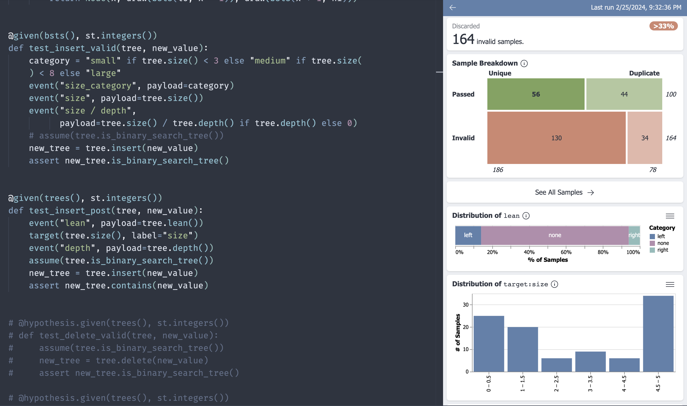

# Tyche

Tyche ([pronounced /ˈtaɪki/](https://en.wikipedia.org/wiki/Tyche)) is a tool that helps developers
to understand the effectiveness of their property-based tests. It works with PBT frameworks like
[Python's Hypothesis](https://hypothesis.readthedocs.io/en/latest/),
[Haskell's QuickCheck](https://hackage.haskell.org/package/QuickCheck),
[Java's JQF](https://github.com/rohanpadhye/JQF/pull/258),
and
[Coq's QuickChick](https://github.com/QuickChick/QuickChick),
and it is easy to [implement](#elsewhere) in your framework of choice if it is not currently
supported.

Tyche is available as an extension for [Visual Studio Code](https://code.visualstudio.com/), but it
can also be accessed [in the browser](https://tyche-pbt.github.io/tyche-extension/).

Tyche is described in detail in a [paper](https://harrisongoldste.in/papers/uist24-tyche.pdf) that
is appearing at UIST'24.



## Motivation

Current property-based testing frameworks give insufficient feedback about the specific values that
were used to test a given program and about the distributional trends in those values. In the worst
case, this lack of visibility process may give users false confidence, encouraging them to believe
their testing was thorough when, in fact, it had critical gaps. Tyche provides an interactive
interface for understanding testing effectiveness, surfacing both "pre-testing" information about
test inputs and their distributions and "post-testing" information like code coverage.

## Using Tyche

### In Hypothesis

Tyche is supported natively in Hypothesis via its [Observability
API](https://hypothesis.readthedocs.io/en/latest/observability.html). Simply run a Hypothesis test
with the `HYPOTHESIS_EXPERIMENTAL_OBSERVABILITY` flag set and Tyche should open automatically with
information about your test results. (If it doesn't open automatically for some reason, you can run
`Tyche: Open` and direct it to the appropriate files in your `.hypothesis/` directory manually.)

You can add *features* to your Tyche visualization using Hypothesis's `event` and `target`
functions. When visualized in Tyche, the following property will display information about generated
list sizes alongside other available feedback:
```python
@given(st.lists(st.integers()))
def test_example(l):
    event("len", payload=len(l))
    ...
```

### In QuickCheck

We have an [experimental library](https://github.com/tyche-pbt/tyche-quickcheck) that adds limited
support for Tyche to QuickCheck. As of now it needs to be installed via GitHub and it is not very
fully featured, but we hope to make this support more robust over time.

### Elsewhere

You can implement support for Tyche in any PBT framework by having each property output data in a
specific JSON lines format. The [Hypothesis
documentation](https://hypothesis.readthedocs.io/en/latest/observability.html) has more information
about the details of the format. Once you have valid JSON lines files, simply run `Tyche: Open` as a
command in VSCode and direct the application to the correct files.

Please contact [Harry Goldstein](mailto:hgoldstein95@gmail.com) if you need help.

If you implement Tyche support for a PBT framework, please let us know so we can provide pointers to
the appropriate documentation from here.

## Developing

### Project Structure

This project is two nested NPM projects. The outer project is the source for the whole extension.
The inner project, in the `webview-ui` directory, is a React project that runs in the extension's
Webview.

### Running in Debug Mode

When working on the webview itself, run:
```bash
npm run start:webview
```
This will allow you to connect to the webview itself via a browser and iterate quickly.

When working on the extension as a whole, run:
```bash
npm run build:webview
```
Then press `F5` to open a new Extension Development Host window.
